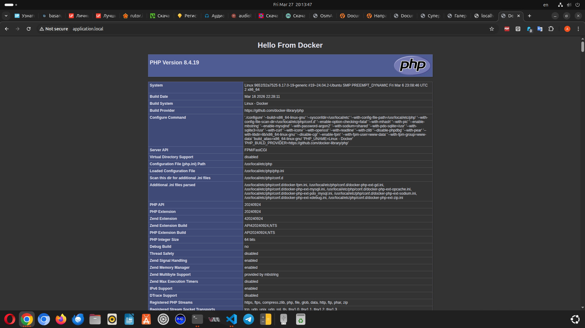

# Продвинутый Backend. Модуль 32. Контейнеры и Docker.

Практическая работа

## Задание 32.6

###Собрана площадка для разработки на базе Docker. Площадка имеет отдельные контейнеры под Nginx, PHP-FPM и MySQL:

- Сайт отвечает на имя application.local, его можно вызвать из браузера.
- При вызове сайт выводит на экран сообщение "Hello from Docker!" и phpinfo.
- Контейнеры сконфигурированы при помощи docker-compose и отдельных Dockerfile.
- Настроен проброс директорий с кодом.
- Настроен проброс в контейнер php файла php.ini, в котором подключается xdebug.
- Настроен проброс в контейнер mysql файла my.cnf, в котором mysql открывается для внешнего подключения.

--------

## Используемые технологии

* HTML
* PHP
* Docker